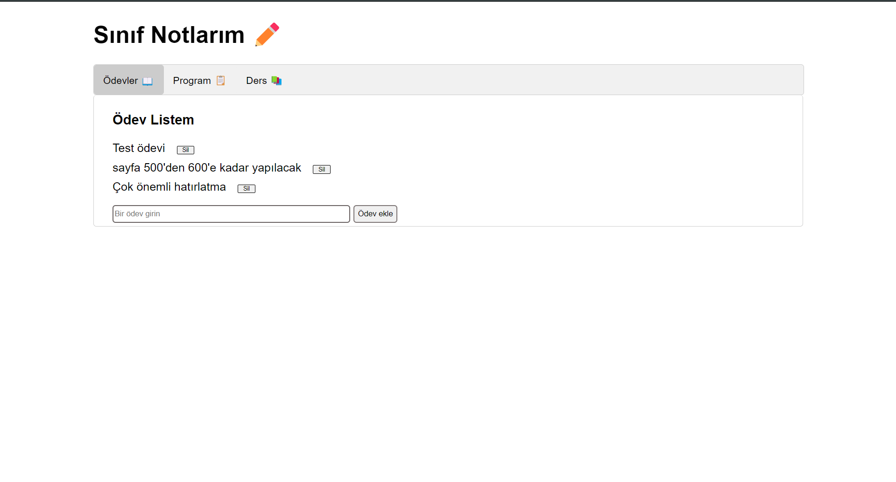
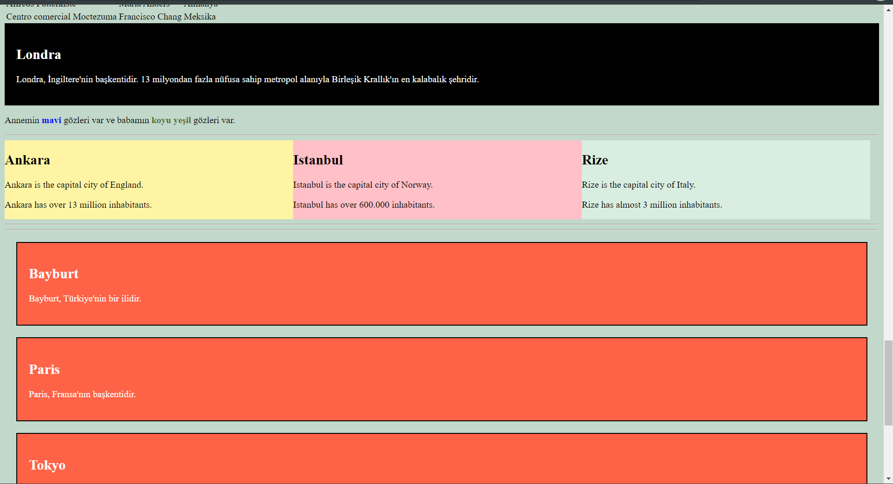

# BTMYO_PROJELER
 
BTMYO_PROJELER'in toplandığı bir repo. Öğrencilere eğitim amaçlıdır.  
Tercih edilen IDE: VS-Code
 

## TODO-List Örneği
 
Bu projede Sayfaya css ile stil vermeyi, js ile yeni html elemanları oluşturup, var olanları kullanmayı öğretmeyi amaçlamaktadır.
 
 

    

## Toplu HTML Örnekleri
 
Bu proje öğrencilerin html kullanmayı kavramaları için sanbox tarzı bir html kodu yazmalarını amaçlamaktadır.
 
 

    

